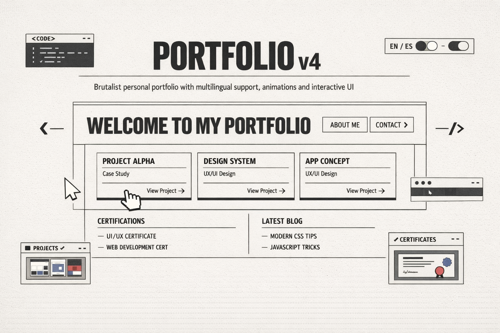

# Portfólio v4

<div align="center">




</div>

[To read in English, click here!](README.md)

## Sobre o Projeto

Portfólio pessoal desenvolvido com **React 19** e **Vite**, estilizado com **Tailwind CSS 4** e animado com **Framer Motion**. O site apresenta um design minimalista com tipografia monoespaçada, troca de tema claro/escuro, suporte multilíngue (Português/Inglês) e componentes interativos como carrossel de certificações com scroll hijacking, cursor personalizado entre outras animações.

## Features

| Recurso | Descrição |
|---|---|
| **Design Brutalista** | Estética minimalista com fonte IBM Plex Mono nos headings, bordas explícitas e layouts assimétricos. |
| **Tema Claro/Escuro** | Alternância via toggle na navbar com persistência em `localStorage`. |
| **Multilíngue** | Suporte completo a Português e Inglês com contexto global e persistência em `localStorage`. |
| **Carrossel de Certificações** | Scroll hijacking captura o evento de rolagem e navega entre os badges via Embla Carousel. Cada badge leva ao perfil Credly. |
| **Seção de Projetos** | Cards com screenshot, stack tecnológica, ano e links para demo e repositório GitHub. |
| **Cursor Personalizado** | Animação de cursor customizado que substitui o ponteiro padrão do navegador. |
| **Animação por Letra** | Heading do nome com animação de cor individual por letra ao passar o mouse. |
| **Navbar Inteligente** | Sticky com destaque automático da seção ativa via `IntersectionObserver`. |
| **Animações com Framer Motion** | Transições de entrada suaves em todas as seções da página. |
| **Responsivo** | Layout adaptado para mobile com hook `useMobile` e breakpoints Tailwind. |
| **Error Boundary** | Componente de tratamento de erros React para evitar tela em branco. |
| **Servidor Express** | `main.ts` serve o build estático e redireciona todas as rotas para `index.html` (SPA). |

## Arquitetura

A aplicação segue uma separação clara entre **client** (React/Vite) e **server** (Express). O `client/src/App.tsx` configura os providers globais (`ThemeProvider`, `LanguageProvider`, `TooltipProvider`, `ErrorBoundary`) e o roteamento via **Wouter**. A página principal (`Home.tsx`) compõe todas as seções em sequência. Os dados de projetos e as traduções ficam centralizados em `lib/projects.ts` e `lib/i18n.ts`, desacoplados dos componentes visuais.

## Tecnologias Utilizadas

- **[React](https://react.dev/) `^19.2.1`** : biblioteca principal para construção da interface; usa hooks modernos e componentes funcionais.
- **[Vite](https://vitejs.dev/) `^7.1.7`** : bundler e dev server ultrarrápido com HMR; configurado com plugin React e Tailwind CSS.
- **[TypeScript](https://www.typescriptlang.org/) `^5.6.3`** : tipagem estática em todo o projeto, tanto no client quanto no servidor Express.
- **[Tailwind CSS](https://tailwindcss.com/) `^4.1.14`** : utilitários CSS; integrado como plugin do Vite (`@tailwindcss/vite`).
- **[Framer Motion](https://www.framer.com/motion/) `^12.23.22`** : animações declarativas de entrada, saída e hover em todos os componentes da página.
- **[Radix UI](https://www.radix-ui.com/)** : primitivos de UI acessíveis (tooltip, scroll-area, tabs, dialog e outros 30+ componentes).
- **[Embla Carousel React](https://www.embla-carousel.com/) `^8.6.0`** : carrossel do slider de certificações com controle programático via API.
- **[Wouter](https://github.com/molefrog/wouter) `^3.3.5`** : roteador client-side leve; define as rotas `/` (Home) e `*` (NotFound).
- **[Express](https://expressjs.com/) `^4.21.2`** : servidor HTTP para servir o build estático em produção na porta `8080`.
- **[lucide-react](https://lucide.dev/)** : ícones SVG como componentes React.

## Instalação

Pré-requisitos:

- **Node.js** `>= 18.0.0`
- **pnpm** `>= 10.0.0`

```bash
git clone https://github.com/giovannipereiradev/my-portifolio-v4.git
cd my-portifolio-v4
pnpm install
```

## Scripts Disponíveis

| Comando | Descrição |
|---|---|
| `pnpm dev` | Inicia o servidor de desenvolvimento Vite na porta `5173` com HMR. |
| `pnpm build` | Gera o build de produção na pasta `dist/`. |
| `pnpm start` | Inicia o servidor Express (`main.ts`) que serve o build na porta `8080`. |
| `pnpm preview` | Visualiza o build de produção localmente via Vite. |
| `pnpm check` | Executa a verificação de tipos TypeScript (`tsc --noEmit`). |
| `pnpm format` | Formata todos os arquivos com Prettier. |

## Estrutura de Pastas

```
my-portifolio-v4/
│
├── main.ts                           # Servidor Express : serve o build estático
├── vite.config.ts                    # Configuração do Vite (plugins, alias @)
├── tsconfig.json                     # TypeScript config raiz (para main.ts)
├── package.json
├── discloud.config                   # Configuração de deploy (Discloud)
├── LICENSE
│
└── client/                           # Aplicação React
    ├── index.html                    # Template HTML (fontes IBM Plex via Google Fonts)
    ├── tsconfig.json                 # TypeScript config do client
    │
    └── src/
        ├── main.tsx                  # Entry point : ReactDOM.createRoot
        ├── App.tsx                   # Providers globais + roteamento (Wouter)
        ├── index.css                 # Estilos globais + variáveis CSS + Tailwind
        │
        ├── pages/
        │   ├── Home.tsx              # Página principal : compõe todas as seções
        │   └── NotFound.tsx          # Página 404
        │
        ├── components/
        │   ├── Navbar.tsx            # Navegação sticky com IntersectionObserver
        │   ├── HeroSection.tsx       # Seção inicial com animações e CTAs
        │   ├── AboutSection.tsx      # Seção sobre
        │   ├── CertificationsSection.tsx # Carrossel de certificações (scroll hijacking)
        │   ├── ProjectsSection.tsx   # Grid de projetos
        │   ├── ContactSection.tsx    # Seção de contato
        │   ├── Footer.tsx            # Rodapé
        │   ├── CustomCursor.tsx      # Cursor animado personalizado
        │   ├── LetterHover.tsx       # Animação de cor por letra
        │   ├── ErrorBoundary.tsx     # Error boundary React
        │   └── ui/                   # 57 componentes Radix UI
        │
        ├── contexts/
        │   ├── ThemeContext.tsx       # Contexto de tema claro/escuro
        │   └── LanguageContext.tsx   # Contexto de idioma PT/EN
        │
        ├── hooks/
        │   ├── useMobile.tsx         # Detecta breakpoint mobile
        │   ├── useComposition.ts     # Hook auxiliar de composição
        │   └── usePersistFn.ts       # Persistência de referência de função
        │
        └── lib/
            ├── i18n.ts               # Traduções PT e EN
            ├── projects.ts           # Dados dos projetos e links sociais
            ├── animations.ts         # Variantes Framer Motion reutilizáveis
            └── utils.ts              # Utilitários gerais (cn, etc.)
```

## Como Usar

```bash
# Desenvolvimento
npm run dev

# Build de produção
npm run build

# Servir em produção
npm start
```

**Adicionando um novo projeto**

Edite `client/src/lib/projects.ts` e adicione um novo objeto ao array `projects`:

```ts
{
  title: "Nome do Projeto",
  description: "Descrição breve.",
  image: "/images/meu-projeto.png",
  tech: ["React", "TypeScript", "Node.js"],
  year: "2025",
  demo: "https://meu-projeto.com",
  github: "https://github.com/usuario/meu-projeto"
}
```

**Adicionando uma nova certificação**

Coloque a imagem do badge em `client/public/images/` e adicione a entrada no array de certificações em `CertificationsSection.tsx`:

```ts
{
  name: "Nome da Certificação",
  image: "/images/meu-badge.png",
  link: "https://credly.com/meu-badge"
}
```

**Adicionando uma nova tradução**

Edite `client/src/lib/i18n.ts` e adicione a chave nos objetos `pt` e `en`:

```ts
export const translations = {
  pt: {
    minhaChave: "Meu texto em português",
  },
  en: {
    minhaChave: "My text in English",
  }
}
```

## Licença
Distribuído sob licença não comercial personalizada. Veja o arquivo [LICENSE](LICENSE) para mais detalhes.